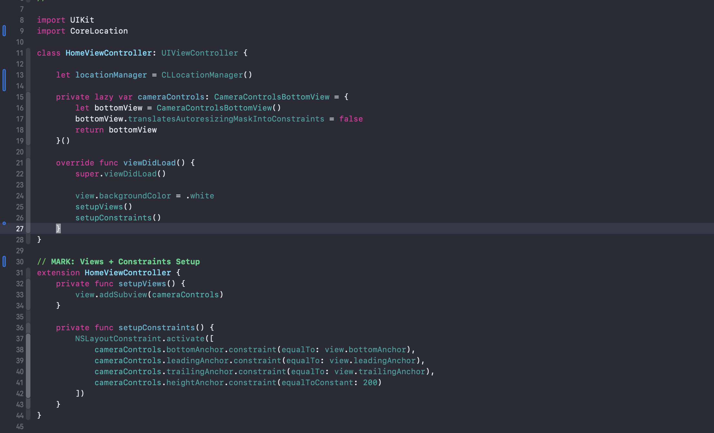
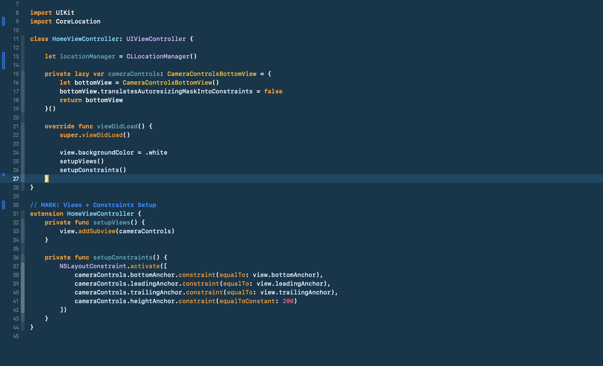
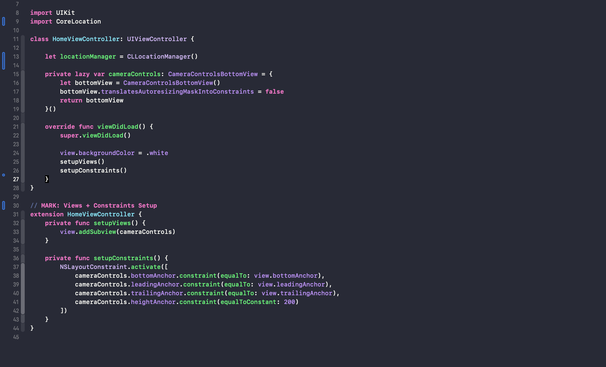
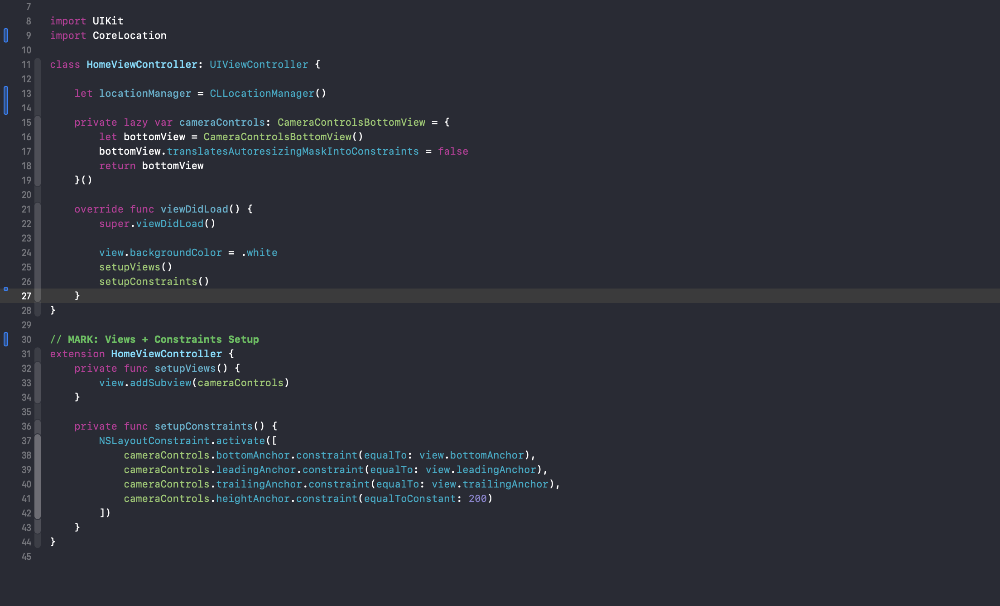
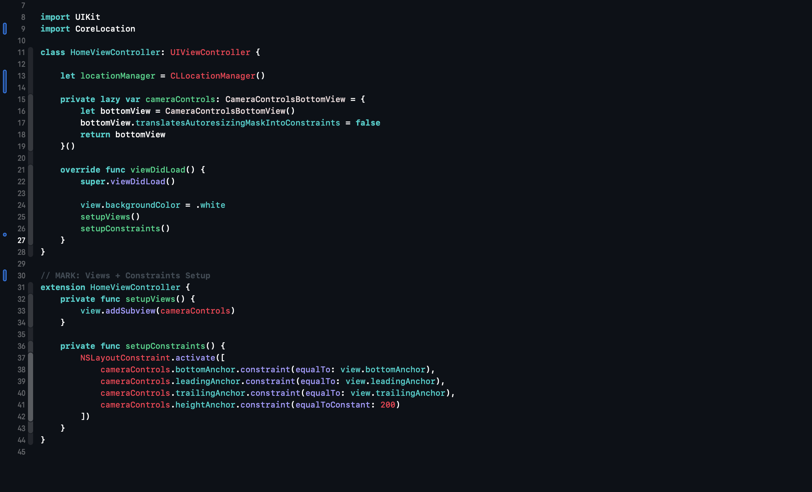

# 🎨 Xcode themes

This repository contains the Xcode theme that I use. Feel free to use it or modify it to your liking 👍

## Installing using Swift Package Manager

The easiest way to install this Xcode theme is to clone this repo and execute `swift run`:

```
$ git clone https://github.com/ddh4r4m/XcodeTheme.git
$ cd XcodeTheme
$ swift run
```

This will install [Adobe's Source Code Pro](https://github.com/adobe-fonts/source-code-pro) font and this Xcode theme for you. Afterward, you can remove the downloaded folder:

```
$ cd ..
$ rm -rf XcodeTheme
```

## Installing manually

You can also choose to do things manually if you want:

1. Clone this repo:
```
$ git clone https://github.com/ddh4r4m/xcodetheme.git
```

2. Create a folder at this path if it doesn't exist already:
```
~/Library/Developer/Xcode/UserData/FontAndColorThemes
```

3. Copy the file `SundellsColors.xccolortheme` into the above folder.

4. Download the latest release of Source Code Pro from [its repo](https://github.com/adobe-fonts/source-code-pro).

5. Unzip the font archive and move the files in the `TTF` folder to `~/Library/Fonts`.

6. Should've used the install script, right? 😉

## Screenshots

### Ayu Dark
<div style="display: flex;">
    
</div>
<br/> <br/>

### Blueloco Dark
<div style="display: flex;">
    
</div>
<br/> <br/>

### CRT Green
<div style="display: flex;">
    
</div>
<br/> <br/>

### Civic
<div style="display: flex;">
    
</div>
<br/> <br/>

### Cobalt
<div style="display: flex;">
    
</div>
<br/> <br/>

### Dracula
<div style="display: flex;">
    
</div>
<br/> <br/>

### Dusk
<div style="display: flex;">
    
</div>
<br/> <br/>

### Flate Arc
<div style="display: flex;">
    
</div>
<br/> <br/>

### Flate
<div style="display: flex;">
    
</div>
<br/> <br/>

### Monokai Pro
<div style="display: flex;">
    
</div>
<br/> <br/>

### Night Owl
<div style="display: flex;">
    
</div>
<br/> <br/>

### Noctis Obscuro
<div style="display: flex;">
    
</div>
<br/> <br/>

### One Dark Pro
<div style="display: flex;">
    
</div>
<br/> <br/>

### Poimandres Dark
<div style="display: flex;">
    
</div>
<br/> <br/>

### Slack Aubergine
<div style="display: flex;">
    
</div>
<br/> <br/>

### Synthwave 84
<div style="display: flex;">
    
</div>
<br/> <br/>

### Tokyo Night
<div style="display: flex;">
    
</div>
<br/> <br/>


## Attributions

This Xcode theme is the result of tweaks and modifications to some version of VSCode themes picked from VSCode MarketPlace. If 
you recognize some aspect of this theme as coming from something you made, feel free to open
an issue and I'll gladly add attributions to you 🙂
